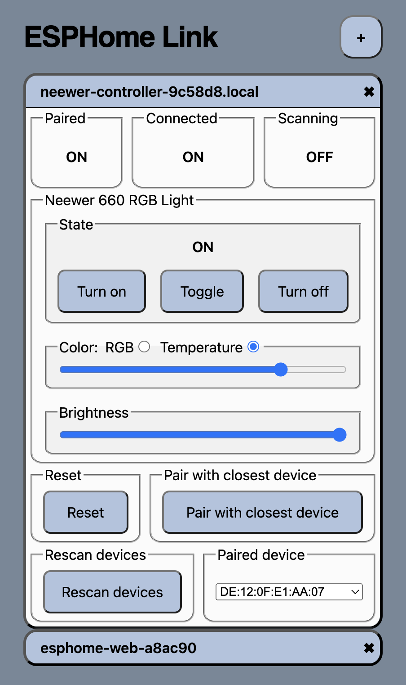

# ESPHome Web App
The ESPHome Web App (ESPWA) is a Progressive Web App (PWA) designed to streamline the setup, configuration, and control of ESPHome-based microcontrollers independently, without requiring additional infrastructure like an ESPHome or Home Assistant instance.

Running directly in your browser, ESPHome Web App operates locally and can even function without an internet connection once cached. Its only requirement is an active ESPHome web_server component for communication with the ESPHome MCU.



## Why Use ESPHome Web App? What Problems Does It Solve?
Common questions often asked are "What problem does this solve?" or "Can't I just use Home
Assistant/ESPHome?".

And while ESPHome and Home Assistant are indeed powerful tools for managing ESPHome-based microcontrollers, they usually necessitate additional infrastructure like a Raspberry Pi or Home Assistant color hardware. ESPHome Web App however does not.

ESPHome Web App uniquely enables provisioning, configuration, and control of ESPHome based devices in locations where such infrastructure might not be readily available, such as caravans and trailers, storage units, company offices, the coffeeshop around the corner or your parents home. There are many settings in which deploying additional hardware to manage and control ESPHome based devices is either too complicated, unsafe or simply unpractical. ESPHome Web App fills this gaps and gives users a viable alternative.

In addition, many "Makers", people and bussinesses that are building and deploying bespoke hardware solutions on the basis of ESPs and ESPHome, have a need for user-friendly and easily customizable user interfaces for their products. ESPHome Web App allows those Makers to deploy a customized and branded version of ESPHome Web App specficically for their users and products, allowing their users to seamlessly setup and control their ESPHome based hardware. All without having to dedicate large budgets to custom app development.

## Features
- Implements all 14 entity types supported by ESPHome web_server, including lights, fans, locks, covers and climate entities.
- Fully local and private. Manages and stores all connection and device information locally
  in your browser and never sends any of that anywhere else.
- Served via an encrypted connection improving safety and security and enabling
  many advanced features (requires a browser with Private Network Access support).
- Provisioning of Wi-Fi and flashing of firmware binaries via a USB connection.
- Touch-friendly user-interface that is easy to use on mobile devices.
- Fully functional and available even while offline (once cached).
- Installable as a standalone app.
- Accessible via keyboard controls with additional accessibility features in the
  works.
- Graceful fallback on browsers that do not support Private Network Access.

* Some features are only available in the most recent versions of modern browsers with Private Network Access support.

## Getting Started
To begin using ESPHome Web App, flash an ESP32 or ESP8266 microcontroller with ESPHome, including the web_server component, and connect it to Wi-Fi.

```yaml
web_server:
```

Then, access ESPHome Web App (an instance is hosted by me at https://esplink.rarelyunplugged.com) and add your ESPHome-based device by clicking the "+" icon in the top-right corner and then the Wi-Fi icon. Enter the IP address or hostname into the input box and confirm the connection.

NOTE: If you are experincing problems connecting to your ESPHome MCU, try using
the IP address instead of the hostname. ESPHomes mDNS hostname resolution can
sometimes be causing intermittent problems.

ESPHome Web App will establish a connection with your ESPHome-based device, displaying all available entities and their respective states. The intuitive UI facilitates various actions, from toggling lights and switches to adjusting light color and color temperature, fan speeds, or cover positions and tilt.

You can easily manage multiple devices within ESPHome Web App, as it
conveniently stores a list of hosts for quick access upon your return. To change
the order of stored devices, simply drag them around.

## Privacy and Security
As a Progressive Web App, ESPHome Web App persists locally in your browser after the initial load, ensuring access even without an active internet connection.

All data exchanged between ESPHome Web App and your ESPHome-based
microcontrollers remains within your local network. The app connects directly to the microcontroller, with no data transmitted back to the servers hosting ESPHome Web App. 

Additionally, the list and addresses of connected devices are stored locally in your browser and are not shared with external parties.

On browsers that support Private Network Access, ESPHome Web App uses an
encrypted connection to the web server hosting the application. This ensures you
privacy and safety while using ESPHome Web App and also enables many of the more
advanced features, like offline access, USB provisioning and firmware flashing.

## Self-hosting and Branding
While an instance of ESPHome Web App is hosted at https://esplink.rarelyunplugged.com, the app is designed for easy self-hosting and branding.

To do so, simply clone this code repository to your web server, run the build
script with `npm run build` and point your document root to the generated `public/`
output folder.

You can customize your instance of ESPHome Web App by creating a esphome-web.json file in the project root. It can be used to override many defaults, like the color scheme, the title and much more.

You can learn more about the customization and branding options including how to
create fully custom setup- and workflows in the [Setup and Customize an ESPHome Web App instance](https://www.rarelyunplugged.com/posts/setup-and-customize-a-esphome-web-app-instance/) guide.

Feel free to reach out to me with any questions or concerns. I'm always happy to help. In addition I can provide professional consulting and support up to and including fully hosted solutions at reasonable rates.
