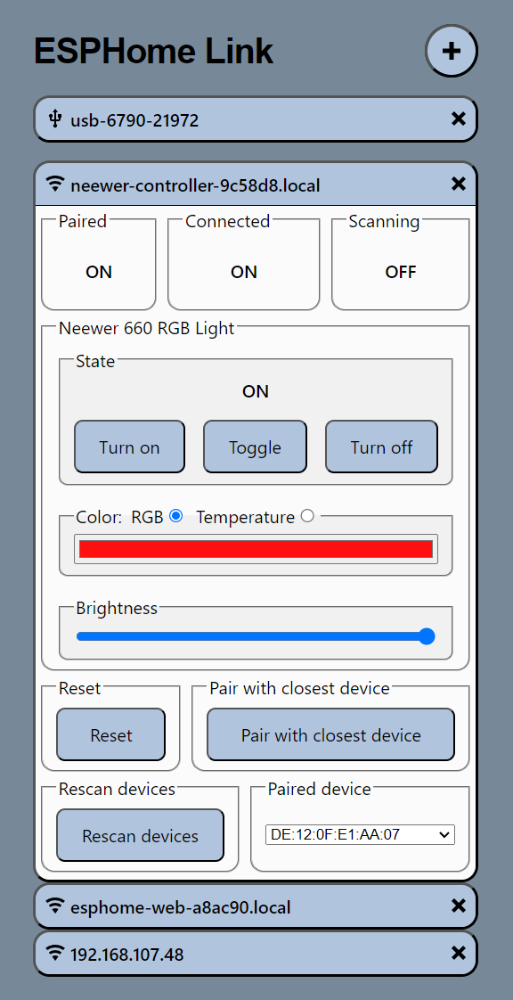

# ESPHome Web App
The ESPHome Web App (ESPWA) is a Progressive Web App (PWA) designed to streamline the setup, configuration, and control of ESPHome-based microcontrollers independently, without requiring additional infrastructure like an ESPHome or Home Assistant instance.

Running directly in your browser, ESPHome Web App operates locally and can even function without an internet connection once cached. Its only requirement is an active ESPHome web_server component for communication with the ESPHome MCU.



## Why Use ESPHome Web App?
While ESPHome and Home Assistant are indeed powerful tools for managing ESPHome-based microcontrollers, they often necessitate additional infrastructure like a Raspberry Pi or Home Assistant color hardware. ESPHome Web App fills the gap by enabling provisioning, configuration, and control of ESPHome devices in locations where such infrastructure might not be readily available, such as caravans and trailers, corporate offices, coffeeshops or other remote settings.

Moreover, for Makers seeking to offer customizable and user-friendly UI for their products, ESPHome Web App provides an accessible and customizable solution. It allows users unfamiliar with Home Assistant or ESPHome to interact with devices seamlessly without additional resources having to be diverted to app or other development.

## Getting Started
To begin using ESPHome Web App, flash an ESP32 or ESP8266 microcontroller with ESPHome, including the web_server component, and connect it to Wi-Fi.

```yaml
web_server:
```

Then, access ESPHome Web App (an instance is hosted at https://esplink.rarelyunplugged.com) and add your ESPHome-based device by clicking the "+" icon in the top-right corner. Enter the IP address or hostname into the input box and confirm the connection.

ESPHome Web App will establish a connection with your ESPHome-based device, displaying all available entities and their respective states. The intuitive UI facilitates various actions, from toggling lights and switches to adjusting light color and color temperature, fan speeds, or cover positions and tilt.

You can easily manage multiple devices within ESPHome Web App, as it
conveniently stores a list of hosts for quick access upon your return.

## Privacy and Security
As a Progressive Web App, ESPHome Web App persists locally in your browser after the initial load, ensuring accessibility even without an internet connection.

All data exchanged between ESPHome Web App and your ESPHome-based
microcontrollers remains within your local network. The app connects directly to the microcontroller, with no data transmitted back to the servers hosting ESPHome Web App. 

Additionally, the list and addresses of added hosts are stored locally in your browser and are not shared with external parties.

## Self-hosting and Branding
While an instance of ESPHome Web App is hosted at https://esplink.rarelyunplugged.com, the app is designed for easy self-hosting and branding.

If you're interested in providing provisioning and control for your ESPHome-based products and devices, ESPHome Web App can be effortlessly customized to feature your branding and tailor UI elements and workflows to your specific needs.

You can learn more about the customization and branding options in the 
[Setup and Customize an ESPHome Web App instance](https://www.rarelyunplugged.com/posts/setup-and-customize-a-esphome-web-app-instance/) guide.

## Future Development
ESPHome Web App is continuously evolving, with plans for additional features such as direct ESP microcontroller flashing from within the app and provisioning Wi-Fi via Improv Serial and Improv Bluetooth.
